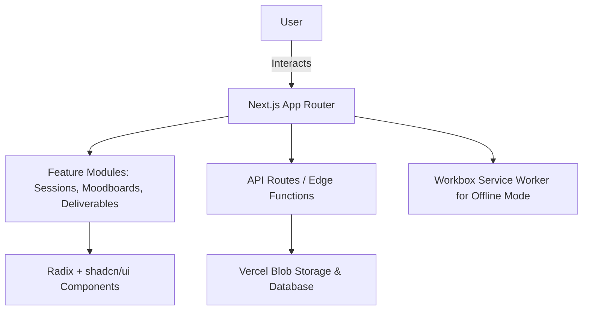

<!-- PortraitPlanner -->

<h1 align="center">PortraitPlanner 📸✨</h1>

<p align="center">
  <b>AI-Enhanced Photography Session Planning Tool</b><br/>
  <a href="https://portraitplanner.vercel.app/">Live Demo</a> • 
  <a href="#-features">Features</a> • 
  <a href="#-tech-stack">Tech Stack</a> • 
  <a href="#-getting-started">Getting Started</a> • 
  <a href="#-contributing">Contributing</a>
</p>

<p align="center">
  <a href="https://portraitplanner.vercel.app/"></a>
  
  
  
  
</p>

---

> **PortraitPlanner** helps photographers and studios plan sessions, organize inspiration, and streamline client communication. Built with **Next.js 15**, **React 19**, and a fully-typed component system, it delivers a clean, responsive UI with a frictionless user experience — perfect for modern creators.

---

<p align="center">
  
</p>

---

## ✨ Features

- **📅 Session Scheduling:** Plan, edit, and manage portrait sessions
- **📸 Moodboard Creation:** Collect inspiration and references for shoots
- **🖼️ Gallery & Deliverables:** Organize client deliverables in one place
- **🎨 Theming:** Dark/light modes with fully customizable UI tokens
- **🔒 Client-Safe:** Designed with security and privacy in mind
- **📱 Mobile-First:** Responsive design that feels native on any device
- **⚡ PWA-Ready:** Workbox-powered offline support for on-site shoots
- **📊 Dashboard:** View upcoming shoots, deadlines, and recent uploads at a glance

---

## 🛠️ Tech Stack

- **Framework:** Next.js 15 (App Router), React 19
- **Styling:** Tailwind CSS v4, shadcn/ui, Radix UI primitives
- **UI/UX:** Lucide React Icons, Embla Carousel, Vaul drawers
- **Forms & Validation:** React Hook Form + Zod
- **State & Theme:** next-themes, Context API
- **Data & Uploads:** @vercel/blob for image handling
- **Offline Support:** Workbox (precaching, strategies, expiration)
- **Charts & Insights:** Recharts
- **Tooling:** ESLint, Tailwind Merge, Class Variance Authority

---

## 🚀 Getting Started

### Prerequisites

- Node.js 18+  
- pnpm or npm (pnpm recommended)

### Quickstart

```bash
git clone https://github.com/your-username/PortraitPlanner.git
cd PortraitPlanner
pnpm install
pnpm dev
```

Visit http://localhost:3000 to explore the app locally.

## Production Build

```bash
pnpm build
pnpm start
```

Deploy instantly on Vercel with:

```bash
vercel --prod
```

## 📖 Architecture Overview
PortraitPlanner follows a modular, component-driven architecture:



This structure keeps features isolated, scalable, and easy to maintain.

## 🤝 Contributing

We welcome PRs, issues, and suggestions!

- Branch Naming: feature/*, fix/*, docs/*
- Commit Messages: Conventional commits preferred (feat:, fix:, chore:)
- Code Style: Linted & formatted (run pnpm lint before PRs)

## 📝 License

MIT — free to use, modify, and contribute. See LICENSE.

---

<p align="center">
  
</p>

---

<p align="center"> <b>PortraitPlanner — Where Creativity Meets Workflow 📸✨</b> </p> 
